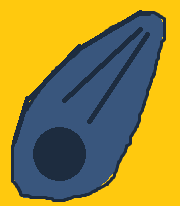

<html lang = "en-us">

<head>
    <title>THESEGAMES</title></head><small>copyright</small>

<body>
    

    
<body background="backgroundgrey.png">

<h1><big><big>THESE GAMES</big></big></h1>

&emsp;Development & Creation for your personal enjoyment through UnityEngine. 

 We hope you like playing THESE GAMES! 

<h1>GAMES</h1>

<h2>Bluba</h2>

<body>

    

</body>
<h2>Pinball1</h2>

<body>
</body> <head><link rel = "stylesheet" type = "text/css" href="index.css">
</head>
<h2>Space Fighter</h2><body></body>
<body>
    

<h1><big>COMING SOON</big></h1>
CaveSearcher

Pinballversion2

</body></body>

<body>

    </body>

<fieldset>

If there are any suggestions, comments, concerns, or requests
 please leave them in the comments below:

<form action = "mail.php" method = "post">

<textarea  name = "comments" id = "comments" style = "font-family:sans-serif;font-size:1.2em;">
...</textarea>
<input type="submit" value="comment"></form>
</body>

</fieldset>

<h3><a href = "aboutus.htm">ABOUT US</a></h3>

<h3>Privacy Policy</h3>
None of you're data is stored by accessing this site. We do not store any of your personal data. If you have sent us a suggestion, comment, concern, or request, none of you're personal data is used or stored. If you have been asked to share any personal data or information by THESEGAMES or any of it's affiliates, say no. We do not require your data for this site. Our site is for your personal entertainment ONLY. 

<h3>Terms & Conditions</h3>

We may modify these Terms, for any reason at any time, by posting a new version on Our Website; these changes do not affect rights and obligations that arose prior to such changes.The contents of this site, including All copyright, trade marks, design rights, patents, Site software, design, artwork, illustrations, Applications, and other intellectual property rights in and on THESEGAMES belongs to THESEGAMES and/or third parties, and any of their successors and assigns, and any of their respective licensors, Advertisers, suppliers, and operational service providers and are legally protected, without limitation, under U.S. Federal and State laws, regulations and treaties. On notice, we will act to remove content on the Site that infringes the copyrights of others. THESEGAMES reserves all of its rights. Nothing in the Terms grants you a right or license to use any trade mark, design right or copyright owned or controlled by THESEGAMES or any other third party except as expressly provided. 

</html>
